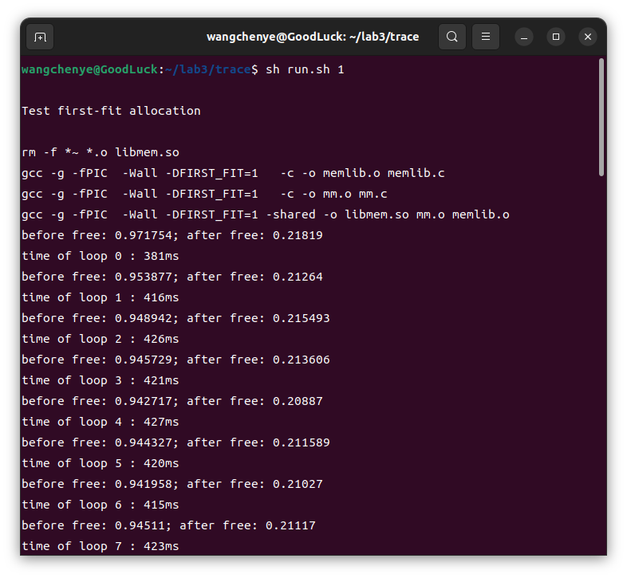
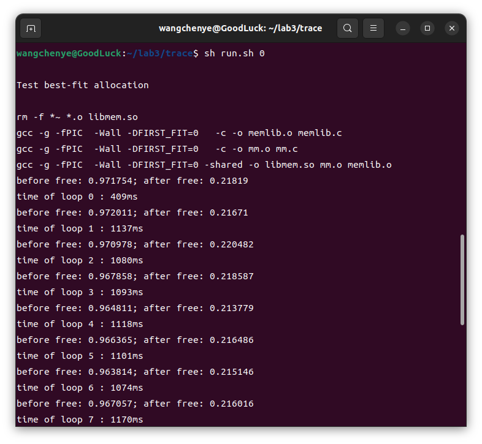

# OS Lab3 report
**PB22111664 王晨烨**
## 1 实验目的
- 使用显式空闲链表实现一个64位堆内存分配器
    - 实现两种基本搜索算法
    - 实现堆内存的动态扩容
    - 实现实时的分配器内存使用情况统计
- 学会以动态链接库的形式制作库并使用
- 体会系统实验数据的测量和分析过程

## 2 实验环境
- OS: Ubuntu 22.04.4 LTS
- 无需在QEMU下调试

## 3 实验内容
### 3.1 堆空间管理
该部分内容主要是是对 memlib.c 文件中`mem_init`和`mem_sbrk`函数的补全实现。

因为堆空间申请内存需要进行用户态和内核态之间的切换，为了减少这种切换带来的开销，我们一次选择使用`sbrk`向内存申请一块较大的`MAX_HEAP`大小的未被分配的虚拟空间，因此堆空间初始化函数为
```c
void mem_init(void) {
   mem_start_brk = (char *)sbrk(MAX_HEAP);  // 堆空间起始地址
   mem_brk = mem_start_brk;                 // 未分配空间的起始地址  
   mem_max_addr = mem_start_brk + MAX_HEAP; // 当前堆空间的最大容量地址
}
```
我们分配内存实际上是在已申请的堆空间中分配，当需要的内存大小超过当前堆空间的容量时，才再次向内核申请内存，因此堆空间的分配函数为
```c
void *mem_sbrk(int incr) {
    char *old_brk = mem_brk; // 需要返回的新分配空间的起始地址
    
    if (mem_brk + incr <= mem_max_addr) // 未超出容量
        mem_brk += incr; // 直接更新未分配空间的起始地址
    else {                              
        sbrk(MAX_HEAP); // 需要申请更多的内存
        mem_max_addr += MAX_HEAP; // 更新堆空间的最大容量
        mem_brk += incr;
    }
    
    return (void *)old_brk;
}
```

### 3.2 内存分配器
由于我们的内存分配操作是在堆空间中进行，而不是直接向内核申请释放，所以我们需要一个内存分配器进行内存管理。

隐式空闲链表的设计方案需要从头开始寻找内存足够的空闲块，因此分配内存的时间复杂度和堆空间中内存块的数量成正比。为了提高性能，我们采用显式空闲链表，将指向前驱和后继的指针放在空闲块的空间里，这样在寻找时就只用考虑空闲块了。

首先补全空闲块合并函数`coalesce`，我们在释放掉一个分配块后，为了避免空闲空间的破碎，需要将其与相邻的空闲块进行合并，具体的代码实现就是用`delete_from_free_list`和`add_to_free_list`维护空闲链表，以及用`PUT`等宏定义修改合并空闲块的头部和尾部：
```c
static void *coalesce(void *bp) {
    size_t prev_alloc = GET_PREV_ALLOC(HDRP(bp));       
    size_t next_alloc = GET_ALLOC(HDRP(NEXT_BLKP(bp))); 
    size_t size = GET_SIZE(HDRP(bp));                   
    
    if (prev_alloc && next_alloc) 
        add_to_free_list(bp); 
    else if (prev_alloc && !next_alloc) {
        delete_from_free_list(NEXT_BLKP(bp));
        PUT(HDRP(bp), PACK(size + GET_SIZE(HDRP(NEXT_BLKP(bp))), 1, 0));
        PUT(FTRP(bp), PACK(GET_SIZE(HDRP(bp)), 1, 0));
        add_to_free_list(bp);
    }
    else if (!prev_alloc && next_alloc) {
        delete_from_free_list(PREV_BLKP(bp));
        bp = PREV_BLKP(bp);
        PUT(HDRP(bp), PACK(GET_SIZE(HDRP(bp)) + size, 1, 0));
        PUT(FTRP(bp), PACK(GET_SIZE(HDRP(bp)), 1, 0));
        add_to_free_list(bp);
    }
    else {
        delete_from_free_list(PREV_BLKP(bp));
        delete_from_free_list(NEXT_BLKP(bp));
        size += GET_SIZE(HDRP(PREV_BLKP(bp))) + GET_SIZE(HDRP(NEXT_BLKP(bp)));
        bp = PREV_BLKP(bp);
        PUT(HDRP(bp), PACK(size, 1, 0));
        PUT(FTRP(bp), PACK(size, 1, 0));
        add_to_free_list(bp);
    }

    return bp;
}
```
我们需要遍历空闲链表寻找合适大小的空闲块，首次匹配`find_fit_first`和最佳匹配`find_fit_best`算法的实现如下:
```c
#if FIRST_FIT
static void *find_fit_first(size_t asize) {
    for (char *p = free_listp; p != NULL; p = (char *)GET_SUCC(p))
        if (GET_SIZE(HDRP(p)) >= asize)
            return (void *)p;

    return NULL; 
}
#else
static void *find_fit_best(size_t asize) {
    char *best_fbp = NULL;
    size_t best_size = 0;

    for (char *p = free_listp; p != NULL; p = (char *)GET_SUCC(p)) {
        if (GET_SIZE(HDRP(p)) >= asize) {
            if (best_size == 0 || GET_SIZE(HDRP(p)) < best_size) {
                best_fbp = p;
                best_size = GET_SIZE(HDRP(p));
            }
        }
    }

    return (void *)best_fbp; 
}
#endif
```
找到这样的空闲块以后，我们要在其中填入一定大小的内容将其变为分配块，此时的分配块可能还会有剩余的未被占用的空闲空间，为了避免内存浪费，如果剩余空闲空间的大小超过一块内存块所需的最小大小`MIN_BLK_SIZE`，则将其从分配块中分割出来成为一块新的空闲块，维护空闲链表和更新空闲块头尾及分配块头部的原理同空闲块合并函数，因此放置块函数实现如下：
```c
static void place(void *bp, size_t asize) {
    delete_from_free_list(bp);
    size_t size = GET_SIZE(HDRP(bp));

    if (size - asize < MIN_BLK_SIZE) {
        PUT(HDRP(bp), PACK(size, 1, 1));
        PUT(HDRP(NEXT_BLKP(bp)), PACK(GET_SIZE(HDRP(NEXT_BLKP(bp))), 1, 1));
        user_malloc_size += size - WSIZE;
    } 
    else {
        PUT(HDRP(bp), PACK(asize, 1, 1));
        bp = NEXT_BLKP(bp);
        PUT(HDRP(bp), PACK(size - asize, 1, 0));
        PUT(FTRP(bp), PACK(size - asize, 1, 0));
        add_to_free_list(bp);
        user_malloc_size += asize - WSIZE;
    }
}
```
为了统计内存使用率，我们需要实时更新堆空间的大小`heap_size`和用户在堆空间中占用的内存大小`user_malloc_size`。

堆空间的增长是在系统调用`sbrk`向内核申请得到的空间中通过调用`mem_sbrk`进行的，而在内存分配器中，我们有两种情况需要调用`mem_sbrk`增长堆空间：
1. `mm_init`初始化内存分配器时，需要四个字大小的堆空间，依次为对齐填充块、序言块头、序言块尾和尾块，序言块和尾块的作用是在操作内存块时不需要考虑边界条件；
2. 内存分配器初始化时需要扩充堆空间获得一块较大的初始内存块，当前的堆空间找不到用户申请`mm_malloc`所需的空闲块时也要对堆空间进行扩充，这一操作由一个封装了`mem_sbrk`的堆空间扩充函数`extend_heap`统一实现。

用户在堆空间中申请释放内存的底层实现是分配块和空闲块的相互转换，所占用内存的变化量即为分配块或空闲块的大小，具体为：
1. 申请内存时`mm_malloc`通过`place`函数将空闲块变为分配块；
2. 释放内存时通过`mm_free`函数将分配块变为空闲块。

## 4 实验结果
首次匹配算法的内存使用率相对低，分配时间短；最佳匹配算法的内存使用率相对高，分配时间长。这个结果符合我们的直观理解。




## 5 实验总结
通过本次实验，我对操作系统管理堆空间的方式有了更深的认识。
